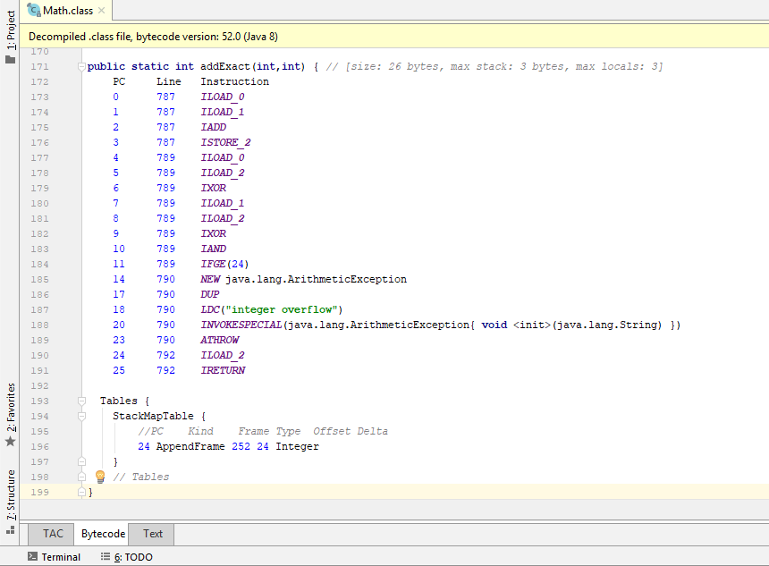
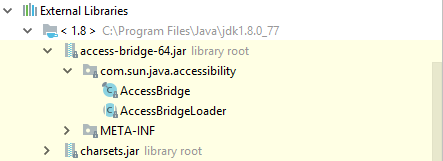

Bytecode Disassembler Plugin for IntelliJ
======

This plugin integrates OPAL into IntelliJ to ease the analysis of Java bytecode. In particular, 
if offers two new views (bytecode and three-address code) for a class file alongside the standard view which IntelliJ provides.

OPAL is an extensible, Java bytecode processing, engineering, manipulation and analysis library written in Scala 2.12.x. 
OPAL supports Java 10 Bytecode and has preliminary support for Java 11; OPAL in particular provides support to facilitate 
the analysis of Java 8 lambda expressions (Invokedynamic instructions). See [OPAL Project](http://www.opal-project.de/) for further details.

## Install

To install the plugin, please follow the instructions provided by JetBrains: 
https://www.jetbrains.com/help/idea/managing-plugins.html

## Features

### Viewing The Output

To view the bytecode or three-address code (TAC), you need to open a class file. Once opened, you can change between the views 
by navigating through the tabs at the bottom of the editor.

To ease the navigation to a class file, we have provided a couple of shortcuts via context menus and hotkeys. In particular,
you can open a specific view

- via the context menu of a class file (right click on a class file)
- via the context menu of a java file (right click on a java file)
- via the context menu of a PsiClass (right click on a class name in a java or jbc editor, see GIF below. Alternatively you can use the hotkeys [Ctrl + Right Click] for bytecode and [Ctrl + Alt + Right Click] for three-address code.[Ctrl + Right Click] for bytecode and [Ctrl + Alt + Right Click] for three-address code.

You can also view class files that are contained within an external library simply by opening them:

### Going To A Declaration

The editors provide functionality to jump to a declaration via [Ctrl + B] or [Ctrl + Left Click], as is standard in IntelliJ.
This works for 

- any fully qualified name apart from lambdas
- for invoked methods
- as well as for methods and fields  that belong to the file that is currently being viewed. 

It, however, does not work for <clinit>().

Everything that is marked can be jumped to. The red arrow shows to which class the method belongs to.

You can also jump to the fields of "this" class file.

### Jump Between The Editors

It's possible to jump back and forth between methods in the "Bytecode" and "TAC" editors. This can be done by pressing
the key combination [Ctrl + Middle Mouse Button] on a method name, or via the context menu.

### Even More Jumps (Bytecode Editor)

You can also jump between instructions within the bytecode editor. This is possible for the if and goto instructions, 
e.g. *GOTO*, *IFGT*, and *IFNULL*. These take the jump destination (a program counter value) as input, 
thus the caret will be placed at that program counter value. To do this, press [Alt + Shift + 1] on one such instruction.

Furthermore it's possible to directly jump to a line in the source code that corresponds to an instruction. To do this,
press [Alt + Shift + 2] on an instruction, or use the context menu. IntelliJ will then navigate to the source file, if available, and place the caret
at the line number of the instruction.

### Structure View (Bytecode Editor)

The structure view has, for the most part, the same look and feel as a normal java file. Additionally though, 
it's possible to jump to the various tables (e.g. the local variable table) in the bytecode editor, if present:

## Known Issues

- Navigation through the structure view requires pressing enter, or alternatively double clicking if an element has no children
- The "Go To Declaration" [Ctrl + B] cannot switch from (e.g.) "Bytecode" to "Text" if the source file is not present. Instead, it will randomly position the caret in the bytecode editor

## Miscellaneous

- At the moment the TAC editor lacks some of the functionality. In particular, method bodies are mostly just highlighted text. 